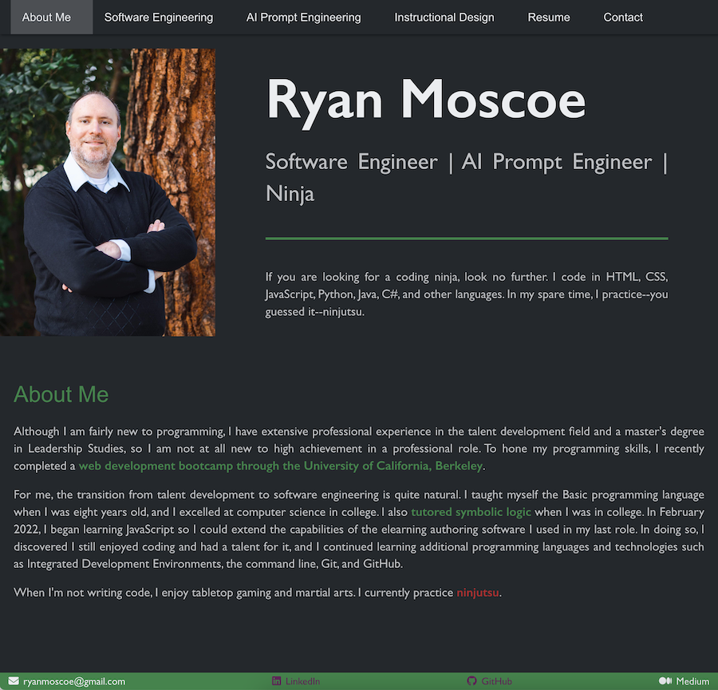

# My Portfolio

## Technology Used 

| Technology Used         | Resource URL           | 
| ------------- |:-------------:| 
| HTML    | [https://developer.mozilla.org/en-US/docs/Web/HTML](https://developer.mozilla.org/en-US/docs/Web/HTML) | 
| CSS     | [https://developer.mozilla.org/en-US/docs/Web/CSS](https://developer.mozilla.org/en-US/docs/Web/CSS)      |   
| Git | [https://git-scm.com/](https://git-scm.com/)     |    
| JavaScript | [https://developer.mozilla.org/en-US/docs/Web/JavaScript](https://developer.mozilla.org/en-US/docs/Web/JavaScript) |
| Node.js | [https://nodejs.org/en](https://nodejs.org/en) |
| Bulma | [https://bulma.io/](https://bulma.io/) |
| React.js | [https://react.dev/](https://react.dev/) |
| Herotofu | [https://herotofu.com/](https://herotofu.com/) |

 

## Description 

[Visit the Deployed Site](https://rmoscoe.github.io/my-portfolio/)

I built this responsive website as a portfolio to showcase my work. The projects in my portfolio demonstrate my skill with a variety of technologies, as well as my evolution as a developer. The portfolio itself also serves as an example of my skill with HTML, CSS, JavaScript and Node.js, the Bulma CSS framework, and the React front-end framework.

 

 

## Learning Points 

In completing this project, I learned a lot about React:
* Creating a React App
* React Hooks
  - useState
  - useEffect
  - useCallback

In addition, I learned about the download attribute for the HTML anchor (\<a>) tag and Herotofu for emailing form submission data.

 

## Author Info

### Ryan Moscoe 

* [Portfolio](https://rmoscoe.github.io/my-portfolio/)
* [LinkedIn](https://www.linkedin.com/in/ryan-moscoe-8652973/)
* [Github](https://github.com/rmoscoe)

 

## License

See repository for license information.